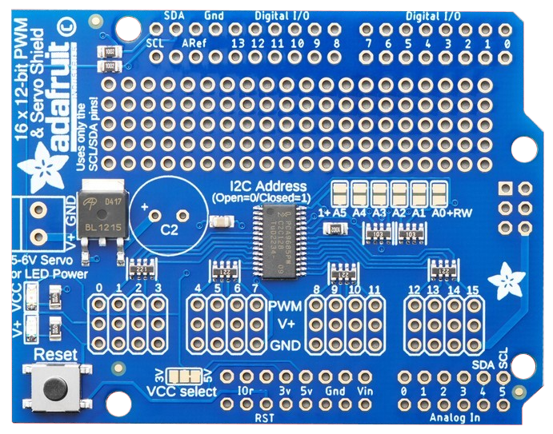
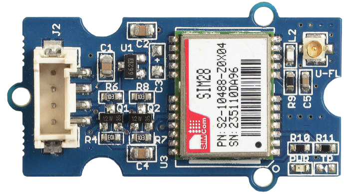
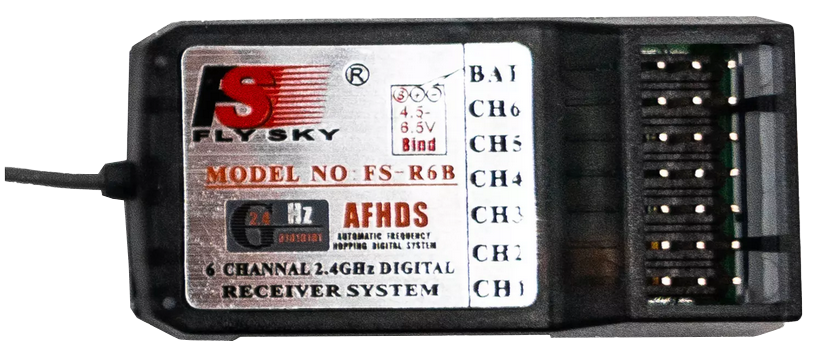
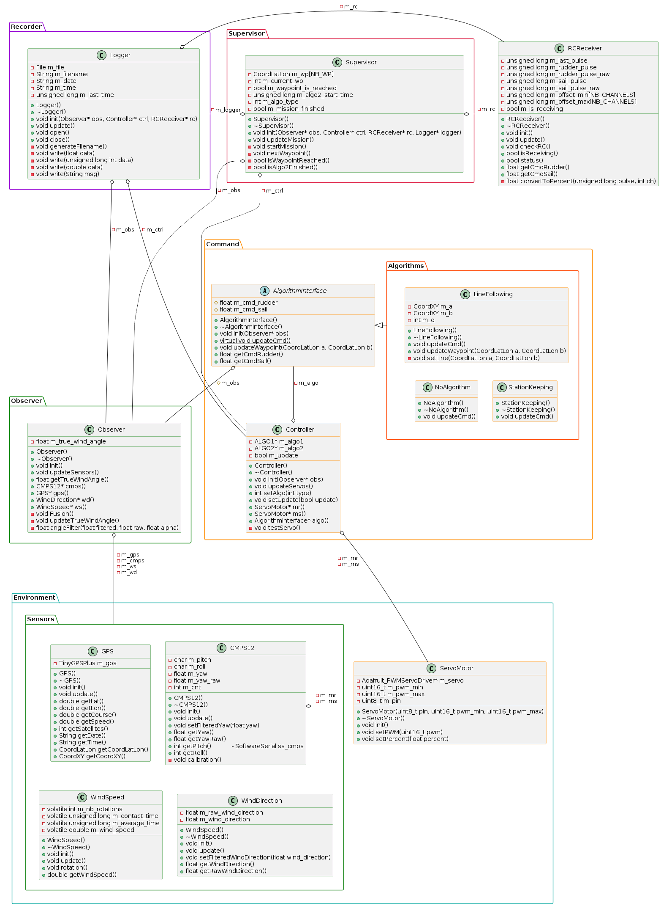

# Aston Autonomous Sailboat 2024

The purpose of this project is to provide a framework for testing different types of algorithms to **control an autonomous sailboat**. To do this, the code is loaded onto an **Arduino MEGA 2560**. The boat is controlled using two servomotors, one of which adjusts the maximum sail angle while the other controls the rudder angle. A series of sensors (IMU, GPS, anemometer) inform the Arduino of the boat's status.   
Another option for this project is to use a **Raspberry Pi** combined with a **Navio 2** board. Although this option is not the main focus of this project, you can find a wiring diagram for the **Raspberry Pi** version [here](images/wiring_diagram/wiring_raspberry.png). This version requires much less wiring and is therefore more compact, but it is also more expensive and complex.


## Hardware

### Circuit Board/Shields  

| Name      | Image                               | E-commerce site              | Power Requirements           |
|-----------|-------------------------------------|------------------------------|------------------------------|
| Arduino Mega 2560 | <p align="center"></p> | [Arduino Store](https://store.arduino.cc/products/arduino-mega-2560-rev3) | 7-12V |
| Grove - Mega Shield | <p align="center"></p> | [Solarobotics](https://www.solarbotics.com/product/29148) | N/A |
| Adafruit 16 x 12-bit PWM & Servo Shield | <p align="center"></p> | [Adafruit](https://www.adafruit.com/product/1411) | N/A |

### Actuators


### Sensors

| Name      | Image                               | E-commerce site              | Power Requirements           |
|-----------|-------------------------------------|------------------------------|------------------------------|
| CMPS12    | <p align="center"></p> | [CMPS12](https://www.robot-electronics.co.uk/cmps12-tilt-compensated-magnetic-compass.html) | 3.3-5V 18mA |
| Grove GPS v1.2 | <p align="center"></p> | [Seeedstudio](https://www.seeedstudio.com/Grove-GPS-Module.html) | 3.3-5V |
| Anemometer - SKU 7911 | <p align="center"></p> | [Davis Instrument](https://www.davisinstruments.com/products/anemometer-for-weather-monitor-or-wizard) | N/A |

### Extra

| Name      | Image                               | E-commerce site              | Power Requirements           |
|-----------|-------------------------------------|------------------------------|------------------------------|
| FlySky FS-R6B | <p align="center"></p> | [FlySky](https://www.flysky-cn.com/fsr6b) | 4-6.5V DC |
| MicroSD Card Adapter | <p align="center"></p> | [Amazon](https://www.amazon.co.uk/dp/B06XHJTGGC?ref_=as_li_ss_tl&language=en_US&linkCode=gg4&linkId=5d0b70740d5b8a9d8b8933d4734d6995&tag=zlufy-20) | 5V |

### Wiring


For comparison, here is the wiring diagram of the **Raspberry Pi-based version**:


## Quickstart Guide

### Requirements

The following arduino libraries are required:

* TinyGPSPlus (v1.0.3)
* Adafruit PWM Servo Driver Library (v3.0.2)
* SD (v1.2.4)
* SoftwareSerial *[installed by default with Arduino IDE]*
* Wire *[installed by default with Arduino IDE]*
* SPI *[installed by default with Arduino IDE]*

### Build the Project

```console
git clone https://github.com/TitouanLeost/Aston-Autonomous-Sailboat-2024.git
```

### Add the Libraries

Copy all the folders inside libraries/ into your Arduino libraries folder:

```console
cd Aston-Autonomous-Sailboat-2024
cp -r libraries/* ~/Arduino/libraries/
```

You can now build the project with Arduino IDE. To do this, open the file [Sailboat.ino](https://github.com/TitouanLeost/Aston-Autonomous-Sailboat-2024/tree/main/Sailboat/Sailboat.ino) and upload it to your Arduino board.

### Experiment

Once everything is ready, you can place all the components inside the boat's hull. Then, to start the mission, turn the remote controller on and off once, and the code will execute.


## Detailed Structure of the Code

The project code is divided into five main blocks:
- Environment
- Observer
- Command
- Supervisor
- Logger

### Environment

This block contains the drivers for the sensors and actuators used, thus serving as the interface between the boat and its environment.

### Observer

This block is responsible for collecting, assembling, and filtering all the data returned by the boat's sensors.

### Command

This block contains the algorithms used to determine the commands to send to the boat's servo motors. The algorithms used can be divided into two types:
- **Type 1 algorithms** allow the boat to reach a waypoint.
- **Type 2 algorithms** allow the boat to perform a task once the waypoint is reached (e.g., station keeping).

During a mission, the boat can use one algorithm of each type or just a type 1 algorithm.

### Supervisor

This block manages the mission's progress. Based on a list of waypoints defined in the [Config.h](https://github.com/TitouanLeost/Aston-Autonomous-Sailboat-2024/tree/main/libraries/Config/Config.h) file, it indicates to the controller what the current objective is and changes the objective when a waypoint is reached. The supervisor is also responsible for selecting the type of algorithm to be used. Finally, the supervisor allows changing the boat's mode of operation: autonomous or radio-controlled.

### Logger

This block is responsible for recording all useful data into a file for subsequent analysis.

### Class Diagram




## Modifying the Code

### Adding New Algorithms

If you want to add new algorithms to the project, you will need to modify these three files:  [Algorithms.h](https://github.com/TitouanLeost/Aston-Autonomous-Sailboat-2024/tree/main/libraries/Algorithms/Algorithms.h), [Algorithms.cpp](https://github.com/TitouanLeost/Aston-Autonomous-Sailboat-2024/tree/main/libraries/Algorithms/Algorithms.cpp), [Config.h](https://github.com/TitouanLeost/Aston-Autonomous-Sailboat-2024/tree/main/libraries/Config/Config.h).  

First, you will need to **define your algorithm** in the files **[Algorithms.h](https://github.com/TitouanLeost/Aston-Autonomous-Sailboat-2024/tree/main/libraries/Algorithms/Algorithms.h) and [Algorithms.cpp](https://github.com/TitouanLeost/Aston-Autonomous-Sailboat-2024/tree/main/libraries/Algorithms/Algorithms.cpp)**. This new algorithm **must be derived from the class AlgortihmInterface** and **contain a constructor, destructor and the method *void updateCmd()***.  
Moreover, if it is a **type 1 algorithm** (used to reach a waypoint), it must **also contain the method *void updateWaypoint()***.  
Once your algorithm is ready to be used, you can **change these lines** in [Config.h](https://github.com/TitouanLeost/Aston-Autonomous-Sailboat-2024/tree/main/libraries/Config/Config.h):

```c++
#define ALGO1 YourType1Algo  // Algorithm used to go from waypoint to waypoint (type 1)
#define ALGO2 YourType2Algo  // Algorithm used when a waypoint is reached (type 2)
```

### Modifying [Config.h](https://github.com/TitouanLeost/Aston-Autonomous-Sailboat-2024/tree/main/libraries/Config/Config.h)

The file [Config.h](https://github.com/TitouanLeost/Aston-Autonomous-Sailboat-2024/tree/main/libraries/Config/Config.h) contains many variables that can or must be changed to modify the behavior of the sailboat. Only those that must be changed will be listed here.

- **REF_LAT** and **REF_LON**
- **WP** and **NB_WP**
- **RUDDER_PWMMIN** and **RUDDER_PWMMAX**
- **SAIL_PWMMIN** and **SAIL_PWMMAX**

To set the rudder and sail PWM, you will need to test your servomotors with different signals and determine the PWM required for each extreme position of the rudder and the sail.


## Additional Tools

In the [tools](https://github.com/TitouanLeost/Aston-Autonomous-Sailboat-2024/tree/main/tools) folder you will find a set of utility codes used for logging data.  

### Reading Log from an SD Card

First of all [read_sd_card.ino](https://github.com/TitouanLeost/Aston-Autonomous-Sailboat-2024/tree/main/tools/read_sd_card/read_sd_card.ino) allows you to **read a file on an SD card connected to the Arduino board**. This is usefull if you can't load the SD card directly into your computer or if you want to save time. **You will need to fill the name of your file wich will be "DDMMhhmm.txt"** *(DD: day, MM: month, hh: hour, mm: minute of the beginning of the experiment)*.  
Then, **you can execute [sd_card_reading.py](https://github.com/TitouanLeost/Aston-Autonomous-Sailboat-2024/tree/main/tools/sd_card_reading.py)** to **save the log** in a file which will be **located in /logs/DDMMYY/hhmmss.txt** *(YY: year, ss: second of the beginning of the experiment)*.  

---

**Here are the complete instructions:**

1. Plug your Arduino MEGA 2560 to your computer.
2. Change the name of the file you want to read in [read_sd_card.ino](https://github.com/TitouanLeost/Aston-Autonomous-Sailboat-2024/tree/main/tools/read_sd_card/read_sd_card.ino).
3. Upload [read_sd_card.ino](https://github.com/TitouanLeost/Aston-Autonomous-Sailboat-2024/tree/main/tools/read_sd_card/read_sd_card.ino) to the Arduino board.
4. Once the file is read, close Arduino IDE.
5. Execute [sd_card_reading.py](https://github.com/TitouanLeost/Aston-Autonomous-Sailboat-2024/tree/main/tools/sd_card_reading.py).
6. Your log file is saved in /logs/DDMMYY/hhmmss.txt.

### Displaying the Logs

To **display different plots of the saved log**, you can **execute [display_log.py](https://github.com/TitouanLeost/Aston-Autonomous-Sailboat-2024/tree/main/tools/display_log.py)**. The images will be **stored as png in /logs/plots/DDMMYY/hhmmss/** *(DD: day, MM: month, YY: year, hh: hour, mm: minute, ss: second of the beginning of the experiment)*.


## Complete Documentation

See the doc on https://titouanleost.github.io/Aston-Autonomous-Sailboat-2024/ 